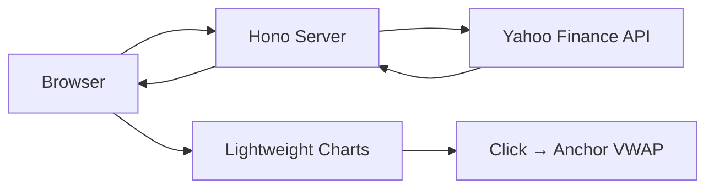

# ⚓ Anchored VWAP

Interactive **Anchored Volume Weighted Average Price** (AVWAP) chart tool powered by Yahoo Finance data.

## Features

- **Click to anchor** — Click any candle on the chart to set the VWAP anchor point
- **All asset types** — Stocks, ETFs, Crypto, Forex, Futures
- **Two timeframes** — 5-minute (5 days of data) and Daily (1 year of data)
- **Symbol search** — Autocomplete search for any Yahoo Finance symbol
- **Real-time VWAP calculation** — `AVWAP = Σ(TP × Volume) / Σ(Volume)` from anchor forward

## How to Use

1. Search for a symbol (e.g., `AAPL`, `BTC-USD`, `EURUSD=X`)
2. Select a timeframe (5 min or Daily)
3. **Click any candle** on the chart to set the anchor point
4. The golden AVWAP line will appear from that point forward
5. Click "Clear Anchor" to remove the VWAP line

## Architecture

## Tech Stack

- **Backend**: Hono (TypeScript)
- **Frontend**: React 18 + TradingView Lightweight Charts
- **Data**: Yahoo Finance v8 API
- **Styling**: Twind (Tailwind CSS)
